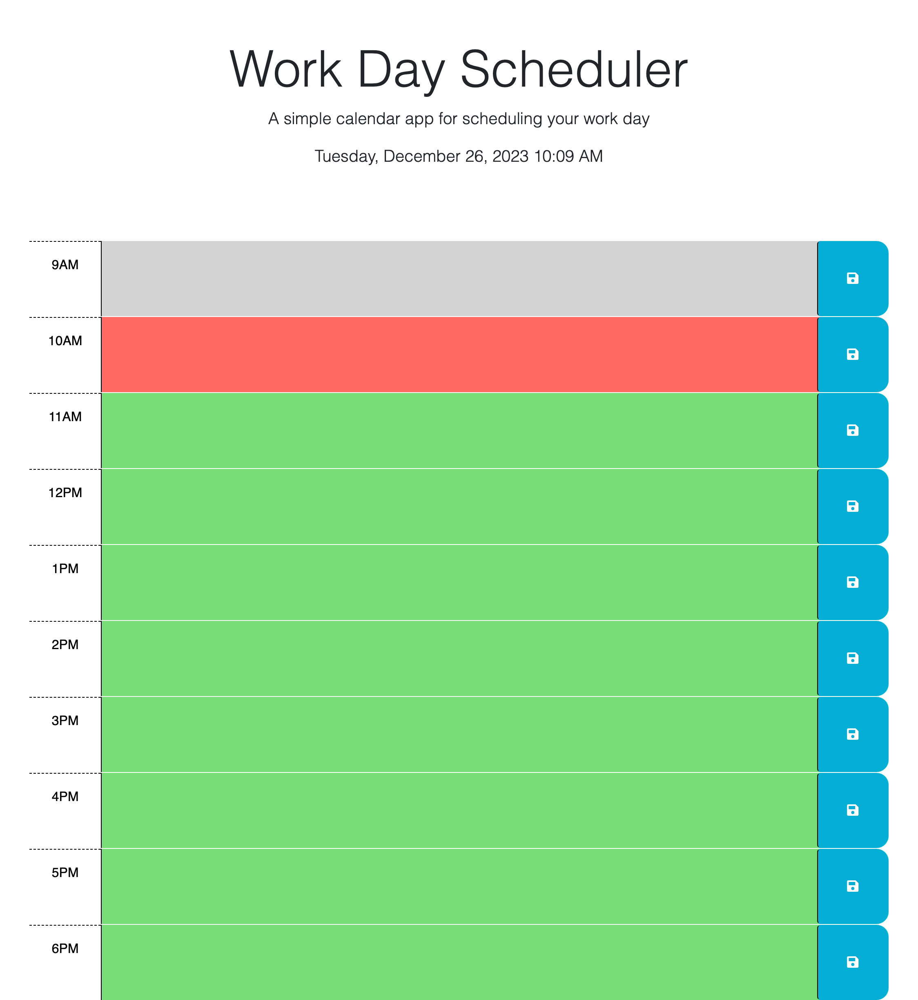

# # Challenge 4 - Work Day Scheduler

## Description
This application is a functional (9am-6pm) work day scheduler, where users can add text input that will save to local storage. The schedule is color coded as grey for past, red for present, and green for future. There is a date and time at the top of the page that will run as the page is open.

## Code Source 

HTTPS: https://kalynsifuentez.github.io/work-day-scheduler/

GitHub Repo: https://github.com/kalynsifuentez/work-day-scheduler.git

## Screenshot

## Acknowledgements
- https://stackoverflow.com/questions/72512032/how-can-i-compare-the-current-time-with-my-divs-id-900-in-javascript
 - [Awesome Readme Templates](https://awesomeopensource.com/project/elangosundar/awesome-README-templates)
 - [Awesome README](https://github.com/matiassingers/awesome-readme)
 - [How to write a Good readme](https://bulldogjob.com/news/449-how-to-write-a-good-readme-for-your-github-project)

- Central Tutor Support - Rene Trevino
